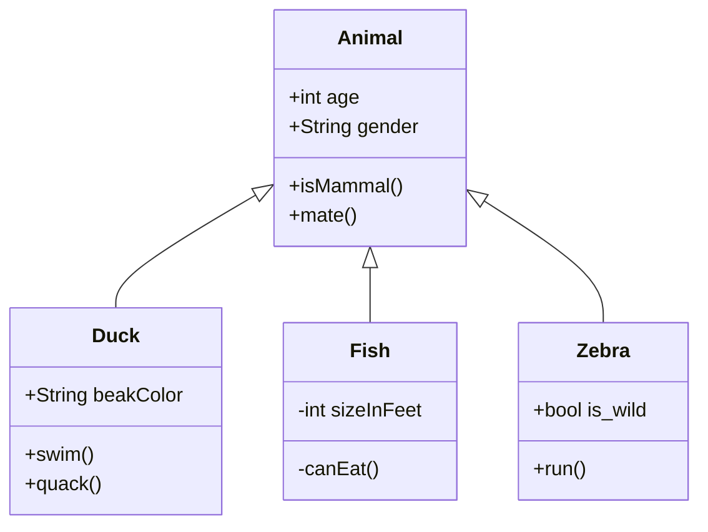

## Desplegar Laboratorio


---

一位著名的科学家（据说是贝特朗·罗素）曾经作过一次关于天文学方面的讲演。他描述了地球如何绕着太阳运动，以及太阳又是如何绕着我们称之为星系的巨大的恒星群的中心转动。演讲结束之时，一位坐在房间后排的矮个老妇人站起来说道：“你说得这些都是废话。这个世界实际上是驮在一只大乌龟的背上的一块平板。”这位科学家很有教养地微笑着答道：“那么这只乌龟是站在什么上面的呢？”“你很聪明，年轻人，的确很聪明，”老妇人说，“不过，这是一只驮着一只一直驮下去的乌龟塔啊！”

大部分人会觉得，把我们的宇宙喻为一个无限的乌龟塔相当荒谬，可是为什么我们自以为知道得更多一些呢？我们对宇宙了解了多少？而我们又是怎样才知道的呢？宇宙从何而来又将向何处去？宇宙有开端吗？如果有的话，在这开端之前发生了什么？时间的本质是什么？它会有一个终结吗？在物理学上的一些最新突破，使一部分奇妙的新技术得以实现，从而对于回答这些长期以来悬而未决的某些问题有所启发。也许有一天这些答案会像我们认为地球绕着太阳运动那样显而易见————当然也可能像乌龟塔那般荒唐可笑。不管怎样，惟有让时间来判断了。


## Fase de Enumeración

## Fase de Explotación

#### H4 Heading

##### H5 Heading

###### H6 Heading


## Code Block

```bash
hostname -I
```
Otro comando que podemos utilizar es el siguiente 

```bash
ipconfig
```

## Image


Hey! I am an image!
{:.desc}

## Math

Inline math: $$E = mc^2$$

Display math:

$$
i\hbar\frac{\partial \psi}{\partial t} = \frac{-\hbar^2}{2m} ( \frac{\partial^2}{\partial x^2} + \frac{\partial^2}{\partial y^2} + \frac{\partial^2}{\partial z^2} ) \psi + V \psi.
$$

## Chart.js

```chart
{
    "type": "bar",
    "data": {
        "labels": ["Red", "Blue", "Yellow", "Green", "Purple", "Orange"],
        "datasets": [{
            "label": "# of Votes",
            "data": [12, 19, 3, 5, 2, 3],
            "backgroundColor": [
                "rgba(255, 99, 132, 0.2)",
                "rgba(54, 162, 235, 0.2)",
                "rgba(255, 206, 86, 0.2)",
                "rgba(75, 192, 192, 0.2)",
                "rgba(153, 102, 255, 0.2)",
                "rgba(255, 159, 64, 0.2)"
            ],
            "borderColor": [
                "rgba(255, 99, 132, 1)",
                "rgba(54, 162, 235, 1)",
                "rgba(255, 206, 86, 1)",
                "rgba(75, 192, 192, 1)",
                "rgba(153, 102, 255, 1)",
                "rgba(255, 159, 64, 1)"
            ],
            "borderWidth": 1
        }]
    },
    "options": {
        "scales": {
            "yAxes": [{
                "ticks": {
                    "beginAtZero": true
                }
            }]
        }
    }
}
```

## mermaid



## Emoji

:smile: :smirk: :racehorse: :wolf: `斜眼笑`{:.emoji-plus} `doge`{:.emoji-plus} `白眼`{:.emoji-plus}


## Tag

`info`{:.info} `success`{:.success} `warning`{:.warning} `error`{:.error}


## Alert

Info.
{:.info}

Success.
{:.success}

Warning.
{:.warning}

Error.
{:.error}
